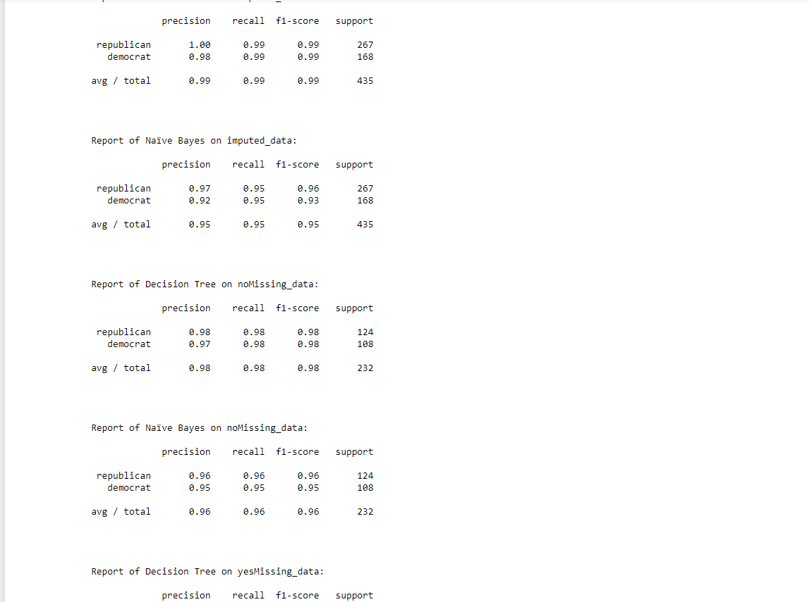

Use Anaconda’s Jupyter with Python 2
Use this dataset: https://archive.ics.uci.edu/ml/datasets/Congressional+Voting+Records
The machine learning problem is use the votes of US congressmen as input and predict whether they are
a Republican or a Democrat. The party is the first column. The other columns are Y or N votes. Missing
data is represented by a ‘?’.
Convert the dataset into 3 datasets:
1. Delete rows where any value is missing (represented by a ?)
2. Impute the missing value.
3. Treat the missing values (represented by ?) as a feature, so the two valued feature (Y, N)
becomes a three valued feature (Y, N, ?)
For each of the above 3 versions of the dataset:
1. Implement a decision tree classifier.
2. Implement a Naïve Bayes classifier
For each of the 6 scenarios (the two classifiers X the 3 versions of the datasets):
? Perform 5-fold cross validation and report precision, recall, and F

  

